# AWS-DevOps-Pipeline-project
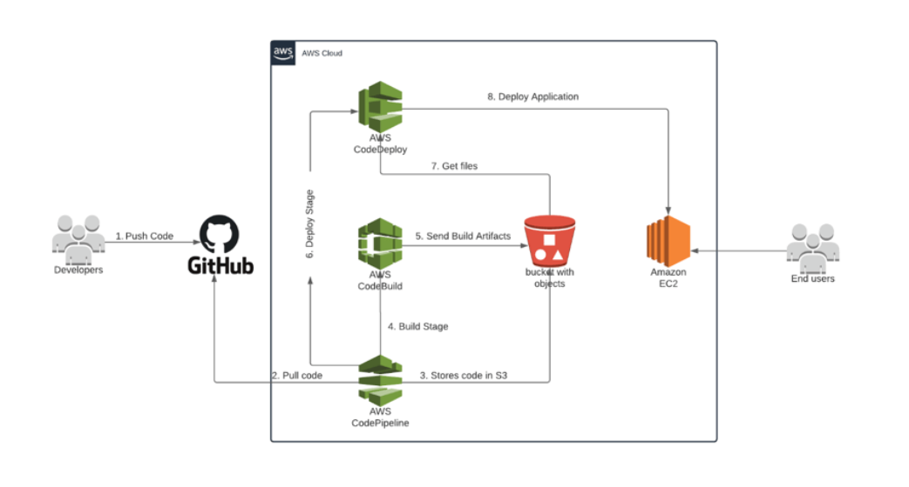

### Project Overview

This project demonstrates a fully automated CI/CD pipeline using AWS CodePipeline, CodeBuild, and CodeDeploy to deploy a web application to an Amazon EC2 instance running httpd as the web server. The pipeline is designed to ensure seamless integration and deployment, leveraging best practices for automation, scalability, and security.

The key components of the project include:

1. **Infrastructure Setup:**
   - Creation of an EC2 instance with the necessary configurations, including the AWS CodeDeploy agent for handling deployments.
   - Configuration of IAM roles to grant required permissions for CodeDeploy and EC2 services.

2. **Source Code Management:**
   - The application's source code is stored in a GitHub repository. The `buildspec.yml` file defines the build instructions and integrates directly with CodeBuild.

3. **Build and Artifact Storage:**
   - AWS CodeBuild compiles the application and prepares the build artifacts.
   - The build artifacts are stored in an S3 bucket, enabling secure and efficient artifact management.

4. **Deployment Automation:**
   - CodeDeploy ensures automated deployment of the application to the EC2 instance.
   - The `appspec.yml` file defines the deployment process, including pre-install, post-install, and validation hooks.

5. **Web Server Configuration:**
   - httpd is used as the web server to serve the application. The deployment process ensures that the web server is configured and started automatically.

6. **Monitoring and Logging:**
   - CloudWatch Logs are configured to capture and store logs from CodeBuild and CodeDeploy for debugging and monitoring purposes.

7. **CI/CD Pipeline:**
   - AWS CodePipeline orchestrates the entire process, automating the sequence of actions from source retrieval to deployment.

---

### Key Features:
- **Automated Deployment:** Ensures rapid and reliable updates to the application with minimal manual intervention.
- **Scalability:** The pipeline can be adapted to handle multiple environments (e.g., staging, production) or deployment strategies (e.g., Blue-Green).
- **Security:** Leveraging IAM roles and S3 bucket policies ensures secure access to resources and artifacts.
- **Monitoring:** Centralized logging and deployment validation ensure that any issues are quickly identified and resolved.

This project serves as an excellent template for organizations and developers looking to implement a robust and secure CI/CD pipeline for their applications in an AWS environment.


## Prerequisites
- AWS account
- IAM user with sufficient permissions (EC2, CodeDeploy, S3, CodePipeline, and CloudWatch)
- GitHub repository with the source code, including a `buildspec.yml` file

---

## Step-by-Step Guide  

### 1. **Create an IAM Role**  
#### a. IAM Role for EC2 (EC2CodeDeploy):  
- Go to **IAM Console** → **Roles** → **Create Role**.  
- Select **AWS Service** → **EC2** → **Next**.  
- Attach the policy **AmazonS3ReadOnlyAccess**.  
- Name the role `EC2CodeDeployRole` and create it.

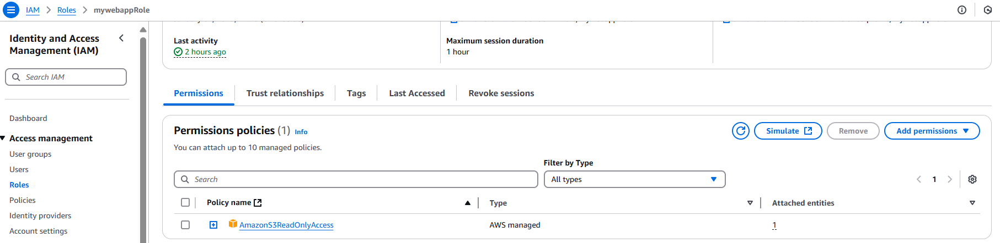

#### b. IAM Role for CodeDeploy (CodeDeployService):  
- Go to **IAM Console** → **Roles** → **Create Role**.  
- Select **AWS Service** → **CodeDeploy** → **Next**.  
- Attach the policy **AWSCodeDeployRole**.  
- Name the role `CodeDeployServiceRole` and create it.

---
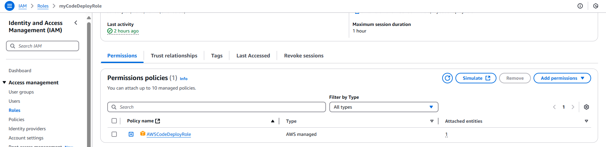

### 2. **Launch an EC2 Instance**  
1. Go to **EC2 Console** → **Launch Instance**.  
2. Choose an **Amazon Linux 2** AMI.  
3. Attach the IAM role `EC2CodeDeployRole`.  
4. Use the following **User Data** script to install the CodeDeploy agent:
### Install the CodeDeploy Agent
Ref: https://docs.aws.amazon.com/codedeploy/latest/userguide/codedeploy-agent-operations-install-linux.html

    ```bash
    #!/bin/bash
    # Update the system
    sudo yum update -y
    # Install dependencies
    sudo yum install ruby -y
    sudo yum install wget -y
    # Download and install CodeDeploy agent
    wget https://aws-codedeploy-us-east-1.s3.us-east-1.amazonaws.com/latest/install
    chmod +x ./install
    sudo ./install auto
    # Start and enable CodeDeploy agent
    systemctl start codedeploy-agent
    systemctl enable codedeploy-agent
    # Check CodeDeploy agent status
    systemctl status codedeploy-agent
    ```
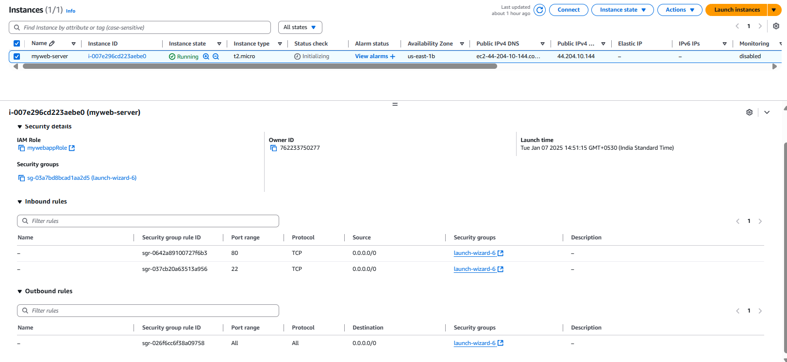
---

### 3. **Create an S3 Bucket for Artifacts**  
1. Go to **S3 Console** → **Create Bucket**.  
2. Name the bucket, e.g., `my-artifacts-bucket`.  
3. Allow the bucket to store CodeBuild artifacts and ensure public access is blocked.

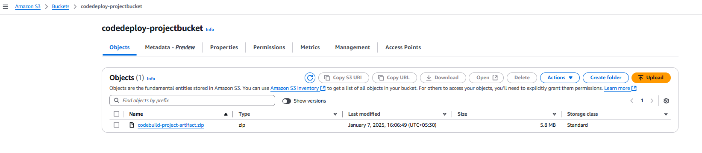
---

### 4. **Set Up CodeBuild**  
1. Go to **CodeBuild Console** → **Create Build Project**.  
2. Configure the following:  
   - **Source Provider:** GitHub  
   - **Environment:** Managed Image → **Amazon Linux**  
   - **Buildspec:** Use the `buildspec.yml` file from the repository.  
   - **Artifacts:** Select **S3**, and specify your bucket name and an artifact folder, e.g., `artifact-folder.zip`.  
   - Enable **CloudWatch Logs** for monitoring.  
3. Save the build project.

    buildspec.yml
    
    ```bash
    ---
    version: 0.2

    phases:
    install:
        commands:
        - echo "Install httpd (Apache HTTP Server)"
        - sudo yum update -y
        - sudo yum install httpd -y
    build:
        commands:
        - echo "Build started on $(date)"
        - echo "Copying index.html to the web server directory"
        - sudo cp index.html /var/www/html/index.html
    post_build:
        commands:
        - echo "Starting httpd without systemctl"
        - sudo /usr/sbin/httpd -k start  # Start httpd manually
        - sudo ps aux | grep httpd  # Confirm httpd is running

    artifacts:
    files:
        - "**/*"
    base-directory: "./"

    ```

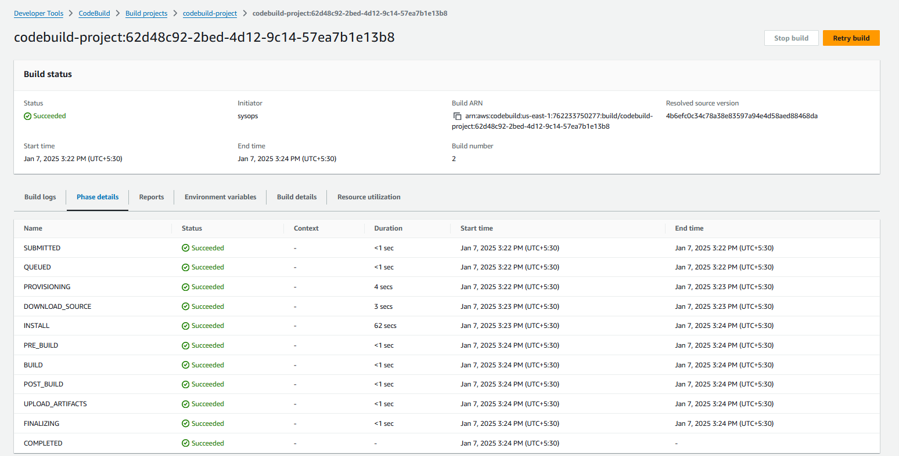
---

### 5. **Set Up CodeDeploy**  
1. Go to **CodeDeploy Console** → **Create Application**.  
   - Name: `my-codeDeploy-project`  
   - Compute Platform: **EC2/on-premises**  

2. Create a Deployment Group:  
   - Name: `my-deployment-group`  
   - Service Role: Select `CodeDeployServiceRole`.  
   - Deployment Type: **In-place**.  
   - Environment Configuration: Choose the EC2 instance(s) with the role `EC2CodeDeployRole`.  

3. Deploy your application.

    appspec.yml 

    ```bash
    version: 0.0
    os: linux
    files:
    - source: /index.html
        destination: /var/www/html/
    hooks:
    ApplicationStop:
        - location: scripts/stop_server.sh
        timeout: 300
        runas: root
    BeforeInstall:
        - location: scripts/before_install.sh
        timeout: 300
        runas: root
    AfterInstall:
        - location: scripts/after_install.sh
        timeout: 300
        runas: root
    ApplicationStart:
        - location: scripts/start_server.sh
        timeout: 300
        runas: root
    ValidateService:
        - location: scripts/validate_service.sh
        timeout: 300
        runas: root

    ```

    stop_server.sh
    ```bash
    #!/bin/bash

    isExistApp=$(pgrep httpd)
    if [[ -n "$isExistApp" ]]; then
    service httpd stop
    fi

    ```
    before_install.sh
    ```bash
    #!/bin/bash

    yum update -y
    yum install -y httpd

    ```
    after_install.sh
    ```bash
    #!/bin/bash

    # Fetch EC2 instance metadata
    EC2_INSTANCE_ID=$(curl -s http://44.204.10.144/latest/meta-data/instance-id)
    EC2_AZ=$(curl -s http://44.204.10.144/latest/meta-data/placement/availability-zone)

    # Update the content in the index.html file
    sed -i "s/was deployed/was deployed on $EC2_INSTANCE_ID in $EC2_AZ/g" /var/www/html/index.html
    chmod 644 /var/www/html/index.html

    ```
    start_server.sh
    ```bash
    #!/bin/bash

    # Start and enable httpd service for YUM-based Linux
    service httpd start
    chkconfig httpd on

    ```
    validate_service.sh
    ```bash
    #!/bin/bash

    # Verify that the httpd webpage is accessible
    curl -v --silent http://localhost:80 2>&1 | grep "<html"

    ```

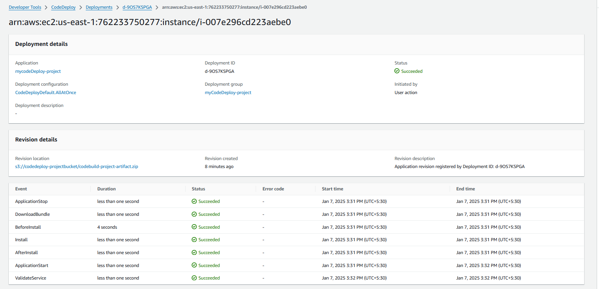
---

### 6. **Create a CodePipeline**  
1. Go to **CodePipeline Console** → **Create Pipeline**.  
2. Configure the following:  
   - **Source Stage:**  
     - Source Provider: GitHub  
     - Repository: Your repository with `buildspec.yml`.  
     - Branch: `main` (or your chosen branch).  

   - **Build Stage:**  
     - Build Provider: CodeBuild  
     - Project Name: Your CodeBuild project name.  

   - **Deploy Stage:**  
     - Deploy Provider: CodeDeploy  
     - Application Name: `my-codeDeploy-project`.  
     - Deployment Group: `my-deployment-group`.  

3. Save the pipeline and trigger the deployment.

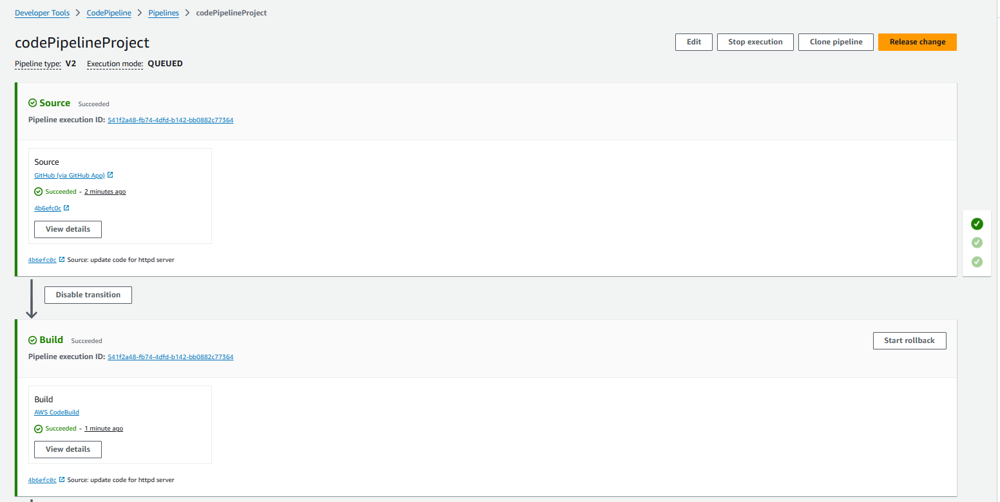
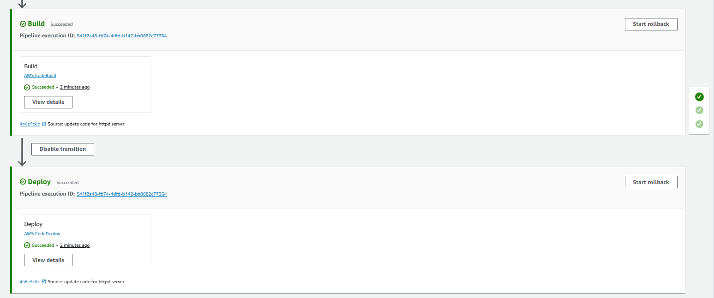
---

### 7. **Validate Deployment**  
- Visit your EC2 instance's public IP address in a browser.  
- Confirm that the application is deployed successfully.  

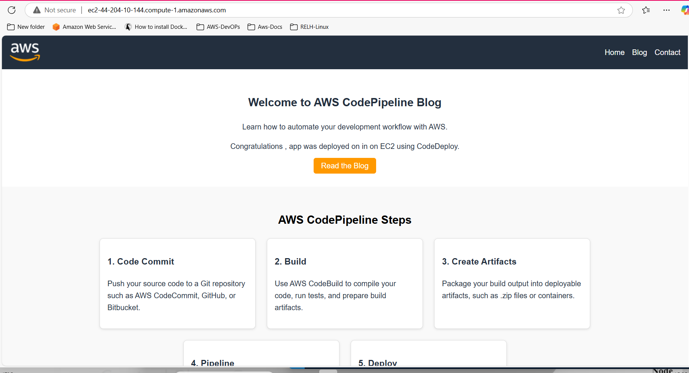
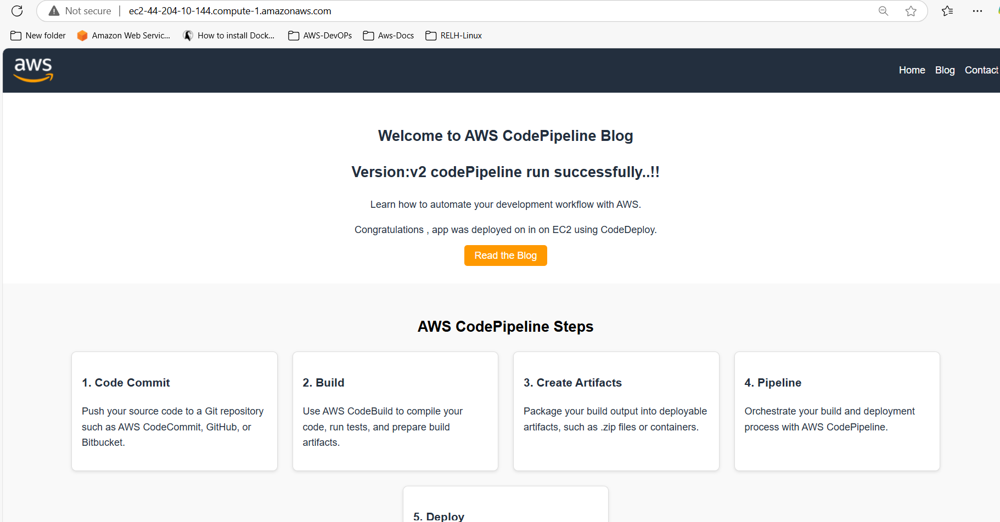
---
